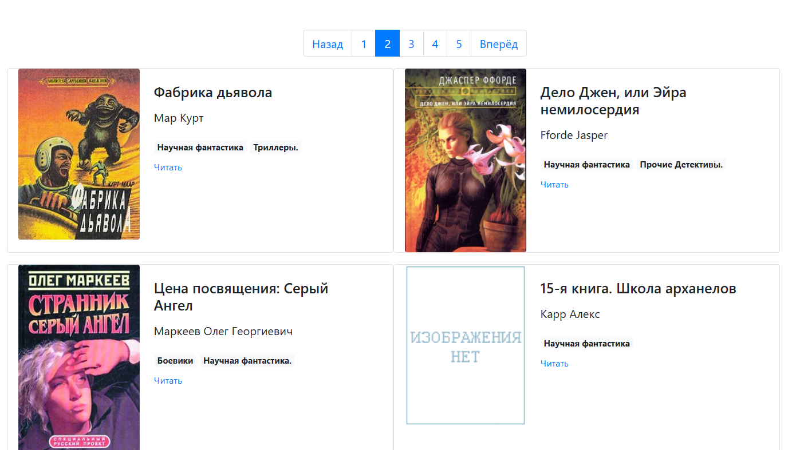

# Онлайн-библиотека

Сайт онлайн-библиотеки.  
Опубликованная версия на Github Pages: [Смотреть](https://linalleks.github.io/online_library/pages/index1.html)

## Использование библиотеки оффлайн

1. Скачайте архив репозитория.
2. В папке **"pages/"** откройте файл **"index1.html"**.  
Вы увидите страницу с навигацией и карточками книг, как на скриншоте:



4. Для перехода по страницам пользуйтесь навигацией cверху.  
Обратите внимание, на одной странице расположены не более 20 книг.
5. Чтобы открыть текст книги, нажмите на ссылку **"Читать"** в карточке интересующей книги.

## Развертывание сайта 

Для запуска сайта у вас должен быть установлен Python 3.

- Рекомендуется использовать [virtualenv/venv](https://docs.python.org/3/library/venv.html) для изоляции сайта.
- Установите зависимости командой `pip install -r requirements.txt`
- Запустите сайт командой `python .\render_website.py`.
- После этого переходите по ссылке [127.0.0.1:5500](http://127.0.0.1:5500), вы увидите первую страницу библиотеки.

## Страницы сайта

Страницы генерируются на основе шаблона **"template.html"** и загружаются в папку **"pages/"** с называниями **"index[номер].html"**.  
Количество страниц зависит от количества книг. На одной странице может быть не больше 20 книг.  

Шаблон страницы получает 3 переменные: 
- `count_pages` — общее количество страниц, 
- `cur_page` — номер текущей страницы, 
- `books` — это список из книг.  
Каждая **книга** — это словарь такого вида:

```
{
    "title": "Роковой поцелуй",
    "author": "Патрацкая Наталья",
    "img_src": "img/nopic.gif",
    "book_path": "books/5648-Роковой поцелуй.txt",
    "comments": [],
    "genres": "Научная фантастика, Прочие Детективы, Прочие приключения."
}
```

Словарь содержит следующие ключи:

* `title` — Название книги,
* `author` — Автор книги,
* `img_src` — путь к файлу обложки книги,
* `book_path` — путь к файлу с текстом книги,
* `comments` — список комментариев о книге,
* `genres` — строка с жанрами, к которым относится книга.


Данные по книгам загружаются из json-файла.  

Путь к json-файлу (относительный или абсолютный) можно задать следующими способами:
1. Указать путь в специальном файле ".env".  
    Для этого в корневой папке сайта создайте файл ".env".  
    В этом файле укажите путь к json-файлу в переменной `JSON_PATH`,
    Пример:
    ```
    JSON_PATH=meta_data.json
    ```
2. При запуске сайта указывать путь к json-файлу как входной аргумент.  
    Например,  
    ```
    python .\render_website.py C:\my_files\file.json
    ```
3. Без заданного пути к файлу программа будет искать его в корневой папке под названием "meta_data.json".


## Цель проекта

Код написан в образовательных целях на онлайн-курсе для веб-разработчиков [dvmn.org](https://dvmn.org/).
